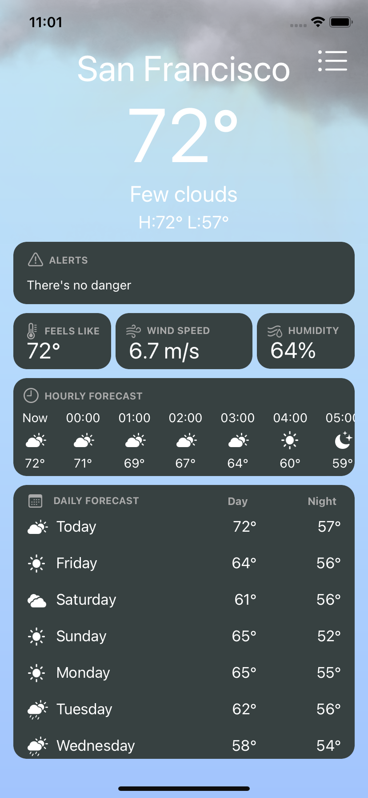
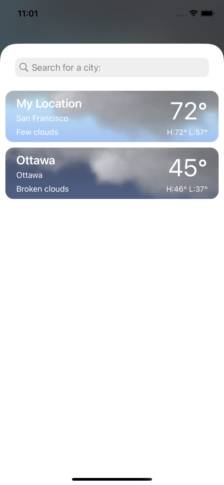

# WeatherApp

## Overview
`WeatherApp` uses [Openweather API](https://openweathermap.org/api) and is built with UIKit. This app shows hourly and daily forecasts, current weather and its details. You can search for cities that are added and stored in a table after the search.

### What is used:
- UIKit
- VIPER architecture
- JSON & Codable
- SpriteKit nodes
- CoreData

## Installation
1. Clone or download this project to your machine. 
2. If you have a valid [Openweather API](https://openweathermap.org/api) key, use it.

## About
Developer - Paul Hirshtein 
App icon - ??? mainstream
